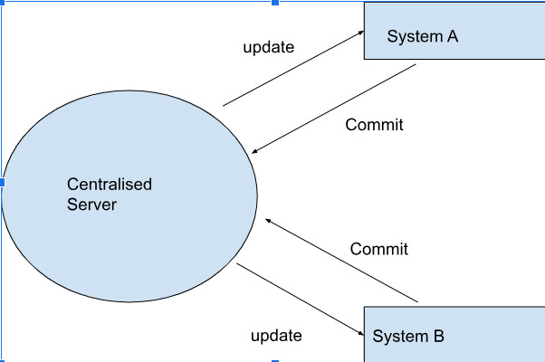
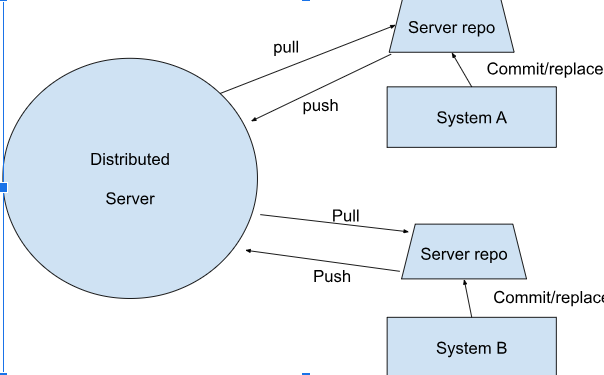

# Git and Version Control

## What is Version Control?

Version control, also known as source control, is the practice of tracking and managing changes to software code. 
Version control systems are software tools that help software teams manage changes to source code over time. 
As development environments have accelerated, version control systems help software teams work faster and smarter. 
They are especially useful for DevOps teams since they help them to reduce development time and increase successful deployments.

Version control software keeps track of every modification to the code in a special kind of database. 
If a mistake is made, developers can turn back the clock and compare earlier versions of the code to help fix the mistake 
while minimizing disruption to all team members. 
Popular version control systems include Git, Subversion (SVN), Mercurial, and Perforce. 
Git, in particular, has become widely adopted due to its speed, flexibility, and distributed nature. 
It's commonly used in software development but can also be applied to manage various types of files and projects.


## What is Git? How does it work?

Git is a DevOps tool used for source code management.
It is a free and open-source version control system used to handle small to very large projects efficiently. 
Git is used to tracking changes in the source code, enabling multiple developers to work together on non-linear development. 
Linus Torvalds created Git in 2005 for the development of the Linux kernel.<br><br>
*Let’s explain a scenario before Git:*

* Developers used to submit their codes to the central server without having copies of their own.
* Any changes made to the source code were unknown to the other developers.
* There was no communication between any of the developers.


*Now let’s look at the scenario after Git:*
* Every developer has an entire copy of the code on their local systems.
* Any changes made to the source code can be tracked by others.
* There is regular communication between the developers.


## Examples of basic workflow commands in git

````
git init
````
The git init command creates a new Git repository. 
It can be used to convert an existing, unversioned project to a Git repository or initialize a new, empty repository.
Most other Git commands are not available outside of an initialized repository, 
so this is usually the first command you'll run in a new project.
````
git status
````
The git status command displays the state of the working directory and the staging area. 
It lets you see which changes have been staged, which haven’t, and which files aren’t being tracked by Git. 
Status output does not show you any information regarding the committed project history.
For this, you need to use ```git log```.
````
git add
````
The git add command adds a change in the working directory to the staging area. 
It tells Git that you want to include updates to a particular file in the next commit.
However, git add doesn't really affect the repository
in any significant way—changes are not actually recorded until you run git ```git commit```.
````
git commit -m
````
A "git commit" is a command in the Git version control system that records changes made to the files in a repository. 
When you commit changes in Git, you are essentially saving a snapshot of the current state of your project.
Each commit has a unique identifier (hash) and includes information such as the author, timestamp, and a message describing the changes made in that commit.

# Distributed Version Control






Centralized Version Control Systems (VCS) like SVN rely on a single central repository, 
requiring constant network connectivity for version control operations. 
Developers work directly on the central repository, making collaboration dependent on the
central server. In contrast, Distributed Version Control Systems (DVCS) such as Git grant each
developer a local copy of the entire repository, 
fostering offline work and speeding up operations by eliminating network dependency.
DVCS allows for more flexible branching and merging, lightweight operations, and inherent 
backup and redundancy through local repositories, making it more resilient and adaptable for 
modern software development workflows.


## What is Github?


GitHub is a platform that facilitates collaborative software development and version control using Git. 
It allows developers to host their code repositories, track changes made to code over time,
and collaborate with others on coding projects. GitHub provides tools for managing project tasks, 
reviewing code changes, and coordinating work among team members. It's widely used in the software development 
community for open source and private projects alike.

## What are some other options/competitors?

* GitLab: GitLab is a web-based Git repository manager with additional features such as issue tracking, CI/CD pipelines, and integrated project management.
* Bitbucket: Bitbucket is a Git-based code hosting and collaboration platform, offering both Git and Mercurial repositories. It provides features for code collaboration, pull requests, and issue tracking.
* SourceForge: SourceForge is a web-based service that offers version control, project management, and distribution of software. It has been around for longer than GitHub and hosts a wide variety of open-source projects.
* AWS CodeCommit: AWS CodeCommit is a fully-managed source control service provided by Amazon Web Services (AWS). It allows teams to host secure and scalable Git repositories.

## How do you link a local repo to a remote repo on GitHub?
* Create a Repository on GitHub: 
  *  Log in to your GitHub account.
Click on the "+" icon in the top-right corner of the page and select "New repository".<br>
  * Follow the prompts to create a new repository, giving it a name and optionally adding a description, choosing visibility (public or private), and selecting other settings.


* Open git bash and make sure you are in the right directory. Then type the following code :
````python 
git init
````

````python 
git add
````

````python 
git commit -m "Initial commit"
````

````python
git remote add origin <remote-repository-url>
````

````python
git remote add origin <remote-repository-url>
````

After completing these steps, 
your local repository should be linked to the remote repository on GitHub, 
and you'll be able to push and pull changes between them.
Check your github page and see if they are linked.


## How do you link a remote repo to a new local repo?

* Create a New Local Repository:
  * Open a terminal or command prompt.
Navigate to the directory where you want to create your new local repository.
Use the git init command to initialize a new Git repository like 
````python
git init
````

Then follow the next steps: 

````python
git remote add origin <remote-repository-url>
````

You are now linked!

When you want to make your first commit, make sure to do the following : 
````python
git push origin master
````
This command pushes the commits from your local master branch to the remote repository named origin.

Once you've completed these steps, your local repository will be linked to the remote repository, 
and you'll be able to synchronize changes between them by pulling and pushing commits as needed.