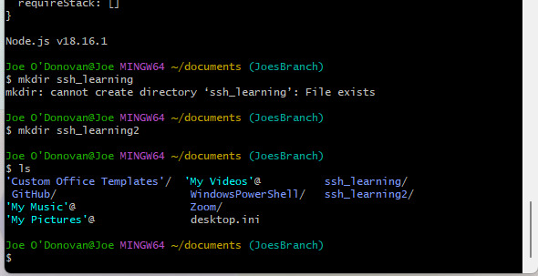

# How make a github repo use SSH keys for authentication

 SSH stands for Secure Shell. It's a cryptographic network protocol used for secure communication over an unsecured network. SSH allows users to securely log into remote systems and execute commands as if they were sitting directly at the remote computer. It provides strong authentication and encryption of data during transmission, making it a popular choice for remote administration and secure file transfer. SSH operates on TCP port 22 by default.

We do not want our repos to be public and be accessed by anyone. SSh auth ensure a secure way of accessing your repo.


## What are the steps  to do this?
### Navigate to GitHub, sign in and create a repository or have one ready. 


### Create your SSH key
Use ssh-keygen to generate a public/private key pairing that you will use for authentication. You can type this in your terminal : 

```
ssh-key gen -t rsa -b 4096 -C "<your_email>"
```

* The terminal will also ask for an optional passphrase, you can enter one but it is not necessary for this example. 
* If you do, you must remember it as you will have to enter it again later.



* Once this is compelted the public/private key will be created. It is located in the hidden .ssh/ directory in your home directory. You can quickly access this by running cd followed by cd .ssh/:

### Copy your key and add it to your GitHub repo

* In your .ssh directory, you should now find two files. One file has no file extension, and the other file has a .pub extension. Both files have the same name as the identifier you provided in step 2. The file with the .pub extension is your public key, while the file without an extension is your private key.
<br>

* Next, you need to send your public key to your GitHub repository so that you can use your private key for authentication. You can display the contents of the file with the .pub extension in the terminal using the cat command:

```
cat github_ssh_example.pub
```

* The lengthy string, which concludes with the comment you specified during the SSH key generation process, represents your public key.
  You should add this public key to your GitHub repository. To do so, copy the entire string and proceed to your repository's settings page.


